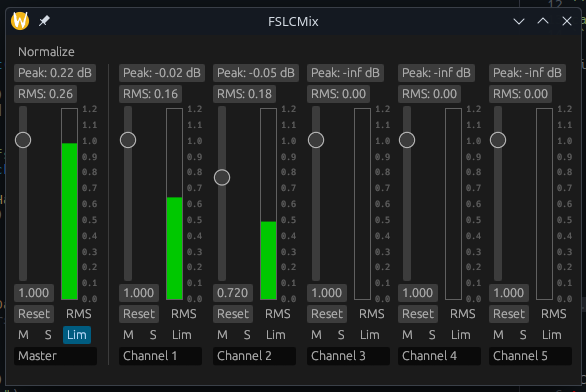

# FSLCMix (Simple Jack Equalizer)

Made for my Linux Audio presentation for the USU Free Software and Linux Club (FSLC). Supports an arbitrary number of channels (default 5), but can be specified on the args via the `-c`/`--channels` argument. The exercise is to check out the `jackless` branch and re-add the JACK functionality without peeking at the `main` branch.



To build:

```
cargo build
```

To run (JACK Audio Server or equivalent must be running):
```
cargo run
```

Licensed under the MIT license.
